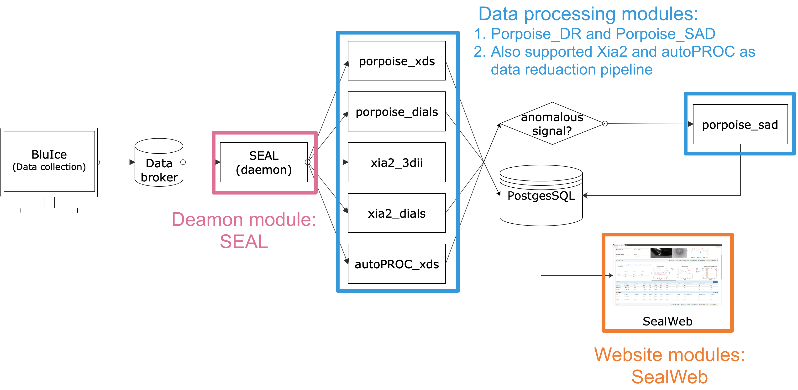

*****
架构
*****
Aquarium由三部分组成:

1. 网站模块：称为SealWeb；可通过网站模块输入样品信息和检查数据处理结构。
2. 数据处理模块：用于完成数据还原，反常散射信号检测，搜索重原子，解析相位和建模等工作。在Aquarium中完成了可支持多节点并行计算的数据还原管线Porpoise_DR和单波长反常散射管线Porpoise_SAD。同时，还支持Xia2和autoPROC等数据还原管线。
3. 后台模块：称为SEAL；后台模块用于和数据收集软件进行通信，并完成提交计算作业，将计算结果存入数据库等工作。

