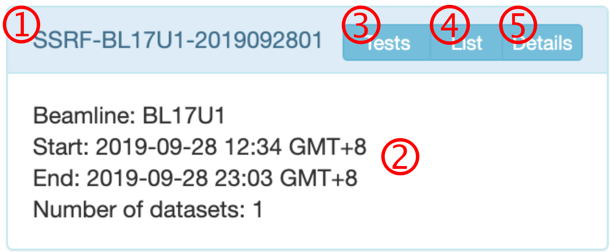
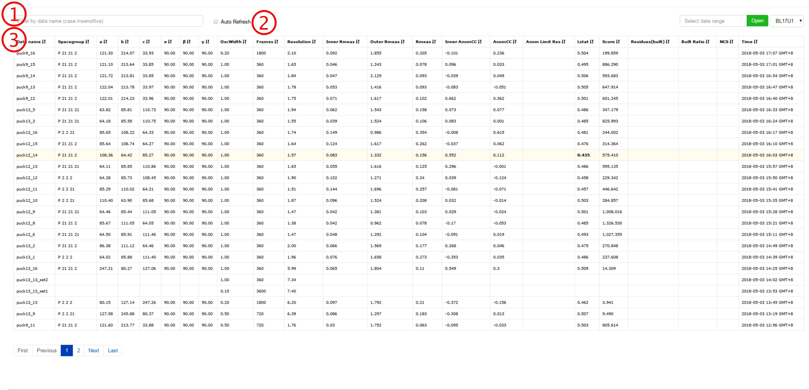

***************
实验数据的组织
***************

Visit
========================

Aquarium按照“Visit”的组织形式，管理和记录每一位用户每次来线站收集的实验结果信息。每一位用户每次来一条线站做一次实验被称作一个“Visit”。当前，SEAL会自动为每一套数据选择或新建一个Visit。如果用户在同一条线站，24小时内收集过数据，则SEAL会将新收集的数据加入这个原有的Visit；否则，SEAL会新建一个Visit。

Visits信息页
========================

 
1.	Visit的名称。本例中为SSRF-BL17U1-2019092801，其中SSRF-BL17U1为收集数据的线站，20190928为建立这个Visit的日期，01表示这是为SSRF-BL17U1在20190928创建的第一个Visit。
2.	Visit的基本信息。
3.	查看测试衍射图（run0）的指标化结果。
4.	以列表形式查看Visit中所有数据的处理结果摘要。
5.	查看Visit中所有数据的详细处理结果。

数据的处理结果摘要页
========================

 
1.	通过数据名称筛选数据，不区分大小写，显示所有包含指定字符串的数据。
2.	如果正在线站收集数据，可以勾选Auto Refresh，可以每2分钟自动更新结果。本例中没有勾选
3.	处理结结果标题栏，可以双击某个标题，是所有结果均按照这个标题升序或降序排列。**默认为按照数据收集时间降序排列。**
4.  每一个数据行，不同的背景色代表不同的含义。

  * 白色：默认颜色。
  * 黄色：Lstat低于0.44，提示可能是孪晶，请注意检查。
  * 蓝色：提示数据可能存在反常散射信号。SEAL判断反常散射信号的依据是inner shell CC_Anom高于0.3且overall CC_Anom高于0.3。这是一个很低的标准，目的是防止遗漏，但同时也会有一小部分数据会被误认为是有反常散射信号，请注意区分。SEAL会自动将有反常散射信号的数据提交Porpoise_SAD管线计算。
  * 绿色：对于可SAD求解相位的数据且Built ratio大于0.6。
