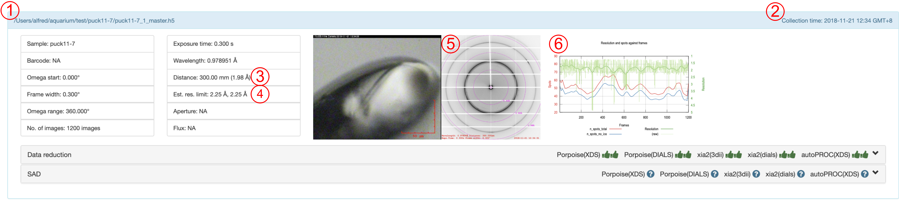
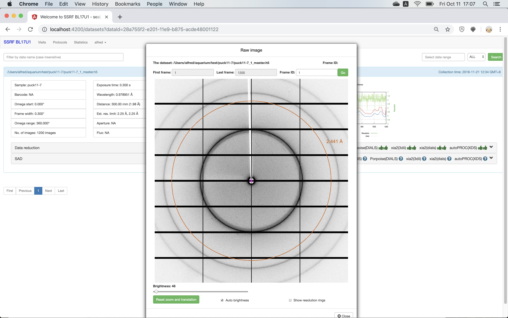

************
数据基本信息
************

 
1.	实验数据的保存位置。
2.	实验数据的收集时间。
3.	探测器与样品距离。括号中为在当前波长和距离条件下，探测器能收集到的最高分辨率（按beamcenter到最远边计算）。
4.	使用两种不同方法评估的本数据的最高分辨率（与数据还原无关）。
5.	单击该缩略图看查看原始衍射数据。
6.	每张衍射图的质量评估（与数据还原无关）。

 
可通过SealWeb直接查看原始衍射图。支持放大、缩小、调节亮度，自动亮度，可显示分辨率。

