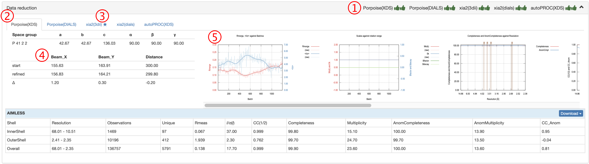

*********
数据还原
*********

数据还原结果显示
================

 
1.  Aquarium使用5种不同管线来完成数据还原。在“Data reduction”标题栏上显示这五个管线的当前状态，具体含义如下：

2.  五个管线的选项卡。请单击不同的管线查看该管线的处理结果。
3.  SEAL会对每一个管线的处理结果进行打分，标记星号的管线是打分最高的管线。
4.  Beamcenter和distance，实验记录值与修正值的比较。如果发现初始值和记录值有很大变化，则需要特别关注，具体分析原因。
5.  各种统计图表。其中“CC(1/2) and CC_Anom against Resolution”可用于判断数据反常信号的强弱。

可通过CC_Anom（蓝色曲线）与分辨率壳层的作图，判断各个分辨率壳层中反常散射信号的强弱。CC_Anom越接近1，该壳层反常信号越强。

修改自动处理结果的空间群，分辨率或排除部分衍射图
====================================================

自动处理结果的空间群，分辨率或排除部分衍射图无需重新运行XDS或DIALS重新积分，所需要用到的软件为：

* 将XDS或DIALS的处理结果导入CCP4：Pointless
* 调整衍射分辨率：Aimless
* 修改空间群：Reindex和Aimless
* 排除部分衍射图：Aimless

以上软件均包含在CCP4软件包内。

数据还原结果中提供了一个XDS_ASCII.HKL格式的文件，文件名为*xxx_unmerged.hkl*。
1.  使用pointless将unmerged hkl文件转换为mtz文件
2.  运行reindex或aimless(可在CCP4图形界面下进行)

.. code:: bash

    pointless –c xdsin xxx_unmerged.hkl hklout xds_sorted.mtz 
    aimless hklin xds_sorted.mtz hklout scaled.mtz > aimless.log << + 
    RESOLUTION LOW 999 HIGH 1.5
    EXCLUDE BATCH 75 to 200
    SCALES CONSTANT
    +

如本例中将排除75到200的衍射图，并将高分辨率cutoff到1.5埃。也可以在CCP4的图形界面中进行。

 
 
