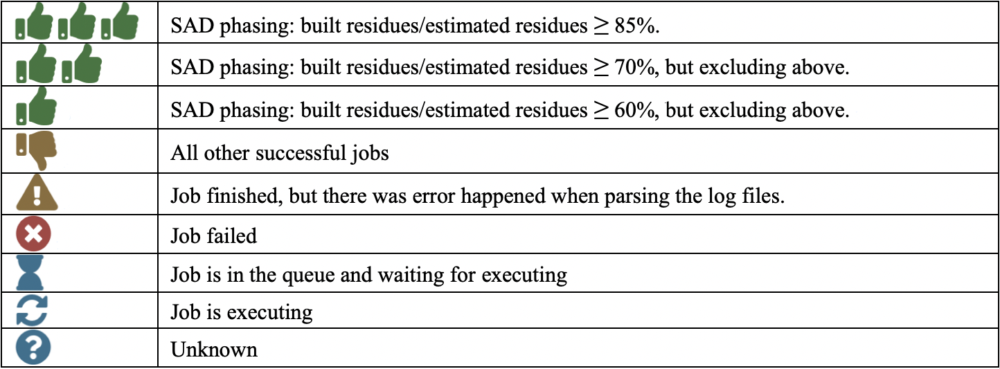
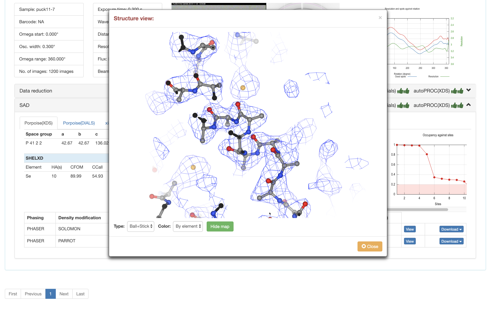

************
SAD相位解析
************
 
1.  Aquarium使用Porpoise_SAD来完成SAD相位解析。如果SEAL判断数据还原管线给出的结果有反常散射信息，SEAL会自动运行Porpoise_SAD管线。“Porpoise_SAD”标题栏上显示以这五个数据还原管线的结果进行SAD相位解析的当前状态，具体含义如下：

2.  五个不同数据还原结果进行SAD相位解析的选项卡。请单击不同的管线查看该管线还原结果进行SAD求解相位的结果。
3.  各种统计图表
4.  结构建模的结果。

 * Porpoise_SAD使用Phaser获得初始相位，使用Parrot和SOLOMON进行密度修正。
 * “Solvent fraction”表示Parrot或SOLOMON在该溶剂含量下获得的相位质量最高
 * “NCS”表示是否检测到了非晶体学对称。如果检测到了NCS，密度修正和结构建模都会利用NCS的信息。
 * “Residues (est.)”表示根据溶剂含量评估的一个不对称单位内的氨基酸残基数。
 * “Residues (built)”表示通过建模找到的所有氨基酸残基数。如果没有提供蛋白序列，仅针对主链建模；如果提供蛋白序列，则包含了所有找到的可以和序列对应或不对应的氨基酸残基。
 * “Residues (docked)”表示建模找到的且可以和蛋白序列对应的氨基酸残基数。如果没有提供氨基酸序列，该值永远为零。
 * “View”单击查看建模的结果和电子密度图。
 * “Download”单击下载建模的结果和电子密度图。

 
在SealWeb中可直接查看建模的结果和对应的电子密度图。可以支持Cartoon，Tube和Ball+Stick等显示模式。
